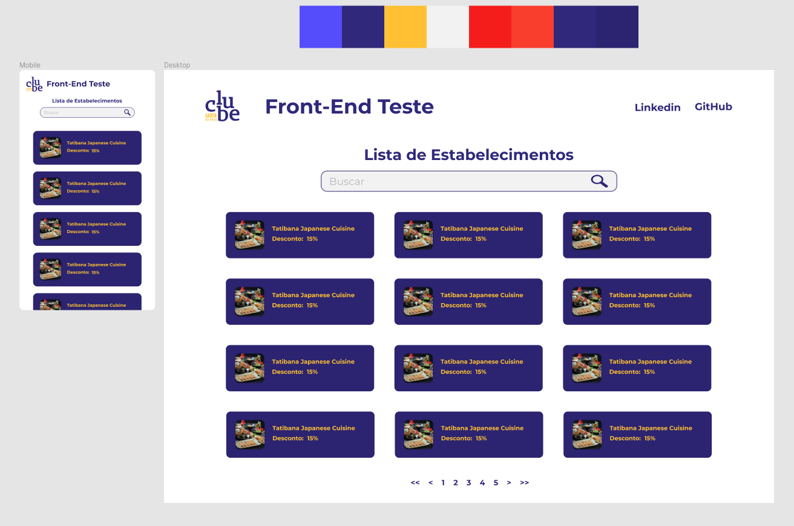

# 🚀 Clube Gazeta do Povo - Front End Test


<center> <h2>☕ Em Desenvolvimento</h2> </center>



> https://gazeta-test.herokuapp.com/ - Página Web Vanilla Desenvolvida como Teste Front-End.

<br>

### Ajustes e melhorias

O projeto ainda está em desenvolvimento e as próximas atualizações serão voltadas nas seguintes tarefas:

- [x] Configurar Ambiente de Desenvolvimento.
- [x] Levantar Requisitos e Assets do Projeto.
- [x] Modelar Protótipo no Figma.
- [x] Implementar Cabeçalho
- [x] Implementar Campo de Busca
- [x] Implementar Lista de Estabelecimentos
- [x] Listar Estabelecimentos em Ordem Alfabética
- [x] Layout Responsivo
- [x] Implementar Busca
- [ ] Implementar Paginação

## 📝 Pré-requisitos

Requisitos definidos pela empresa:

- Implementar Lista de Estabelecimentos
- Consumir Lista de Estabelecimentos de API
    - https://gdp-prd-clube.s3.amazonaws.com/api/repository/partners/all.json
- URL Base para Imagens
    - https://clube-static.clubegazetadopovo.com.br/
- Campo de Busca Com Filtro Atualizando por Letra
- Mostrar Imagem (*cover*) e Nome do Estabelecimento (*fantasyName*)
- Mostrar Porcentagem de Desconto do Estabelecimento (*discountAmount*)
- Listar Estabelecimentos em Ordem Alfabética (*fantasyName*)
- Layout Responsivo

## ⚙️ Instalando o Projeto
Siga estas etapas:

```
npm install

npm run dev
```

## 💻 Feito Com:


## 🤝 Desenvolvido Por

<table>
  <tr>
    <td align="center">
      <a href="https://github.com/pumba-dev">
        <br>
        <sub>
          <b>Eu Mesmo</b>
        </sub>
      </a>
    </td>
  </tr>
</table>

[](https://www.linkedin.com/in/pumba-dev/)


## 😄 Seja um dos Contribuidores<br>

Entre em contato para se tornar um contribuidor.

## 💰 Donate

[](https://picpay.me/pumbadev)
[](https://nubank.com.br/pagar/1ou9f/ifu2K7YNO7)

## 📝 Licença

Copyright © 2022 Pumba Developer
